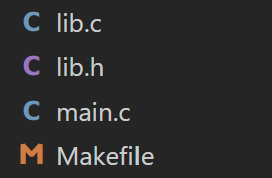

# 📌 MAKEFILE CƠ BẢN
# Phần 1: GIỚI THIỆU VỀ MAKEFILE
- Bản chất makefile dùng để thực thi các command
- Khi dùng makefile để rebuild một dự án, nó sẽ chỉ build lại những file đã thay đổi giúp giảm thời gian rebuild
---
# PHẦN 2: CÁCH BUILD FILE .c BẰNG GCC
## 2.1 Có 1 file main.c duy nhất
Có chương trình như sau:
```c
#include <stdio.h>
int main(){
    printf("Hello world");
    return 0;
}
```
Cách build với gcc:
```bash
gcc main.c -o main
```
Trong đó:
- `"-o"`: output
- `"main.c"`: file cần biên dịch
- `"main"`: file output (.exe)

## 2.2 Có nhiều file .c, .h link với nhau
**Cấu trúc thư mục hiện tại như sau**


- **main.c**
```c
#include "lib.h"
void main(){
    printf("hello world \n");
    xinchao();
}
```
- **lib.h**
```c
#ifndef LIB_H
#define LIB_H
#include <stdio.h>
void xinchao();
#endif
```
- **lib.c**
```c
#include "lib.h"
void xinchao(){
    printf("hello anhquoc");
}
```
**Cách 1:**

```bash
gcc main.c lib.c -o app
```


**Cách 2:**


**Cách 3:**


---
