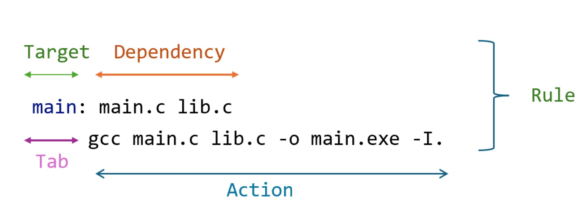

# 📌 MAKEFILE CƠ BẢN
# PHẦN 1: GIỚI THIỆU VỀ MAKEFILE
- Bản chất makefile dùng để thực thi các command
- Khi dùng makefile để rebuild một dự án, nó sẽ chỉ build lại những file đã thay đổi giúp giảm thời gian rebuild
---
# PHẦN 2: CÁCH BUILD FILE .c BẰNG GCC
## 2.1 Có 1 file main.c duy nhất
Có chương trình như sau:
```c
#include <stdio.h>
int main(){
    printf("Hello world");
    return 0;
}
```
Cách build với gcc:
```bash
gcc main.c -o main
```
Trong đó:
- `"-o"`: output
- `"main.c"`: file cần biên dịch
- `"main"`: file output (.exe)

## 2.2 Có nhiều file .c, .h link với nhau
**Cấu trúc thư mục hiện tại như sau**


- **main.c**
```c
#include "lib.h"
void main(){
    printf("hello world \n");
    xinchao();
}
```
- **lib.h**
```c
#ifndef LIB_H
#define LIB_H
#include <stdio.h>
void xinchao();
#endif
```
- **lib.c**
```c
#include "lib.h"
void xinchao(){
    printf("hello anhquoc");
}
```


**Cách 1:**
B1: Từng file.c build ra từng file .o B2: Link các file .o đó lại với nhau
```bash
--> gcc -c main.c -o main.o      -> Build ra file main.o
--> gcc -c lib.c -o lib.o        -> Build ra file lib.o
--> gcc main.o lib.o -o main.exe -> Build ra file main.exe là file để chạy của chương trình
```
Trong đó:
- `"-c"`: tạo ra các file object
- `"-o"`: tạo ra file output

**Cách 2:**
Đơn giản hơn, chúng ta gộp các lệnh trên bằng việc dùng `"-I."`: gcc sẽ thực hiện tìm kiếm trong **thư mục hiện tại** `"."` để thêm các file header khác


```bash
--> gcc main.c lib.c -o main.exe -I.-> Build ra file main.exe là file chạy của chương trình
```
Nếu lib.h nằm trong thư mục con **include/**, bạn sẽ phải biên dịch bằng: 
```bash
gcc main.c lib.c -I include/ -o myprogram.
```

==> Nhận thấy rằng cả hai cách trên đều không clean với các dự án lơn --> Make file chính là để dùng cho trường hợp như vậy

---
## PHẦN 3: RULE CỦA MAKEFILE CƠ BẢN


- **Rule**: các rule cần thực hiện khi compile
- **Dependency**: là các file cần thiết để tạo ra target
- **Action**: là câu lệnh compile để tạo ra Target từ Dependency. Action được thụt lùi vào 1 Tab (phím tab trên bàn phím) so với Target
- **Target**: Là tên của nhiệm vụ hoặc file mà bạn muốn make tạo ra

## PHẦN 4: BIẾN TRONG MAKEFILE
- Biến trong makefile được khởi tạo như sau
```bash
NAME = VALUE
```
- Biến được call bằng
```bash
${NAME} hoặc $(NAME)
```
## PHẦN 5: TẠO MỘT MAKEFILE CƠ BẢN

```bash
CC=gcc
CFLAGS=-I.
main: main.c lib.c
    $(CC) main.c lib.c -o main.exe -I.
```
- Đoạn makefile trên sau khi chạy câu lệnh make main: thì sẽ cho ra main.exe: là file chạy của chương trình


---
